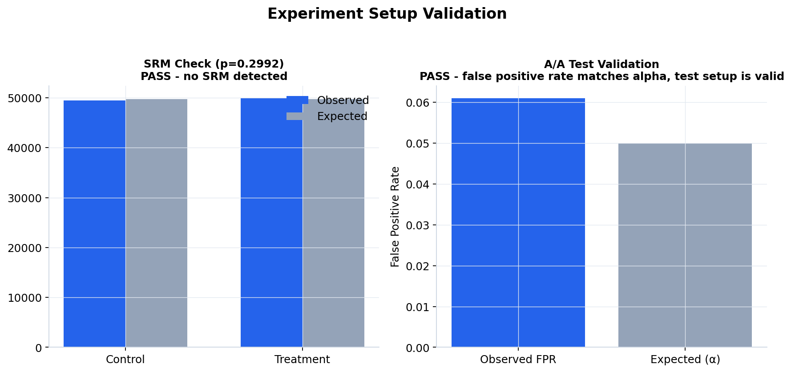
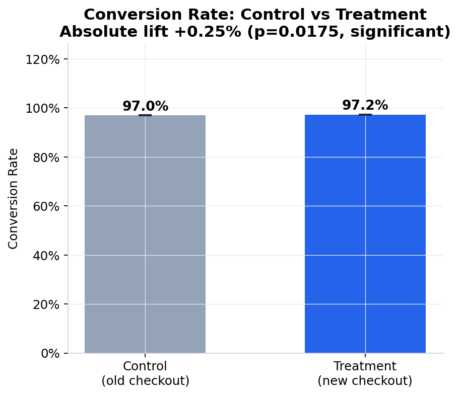
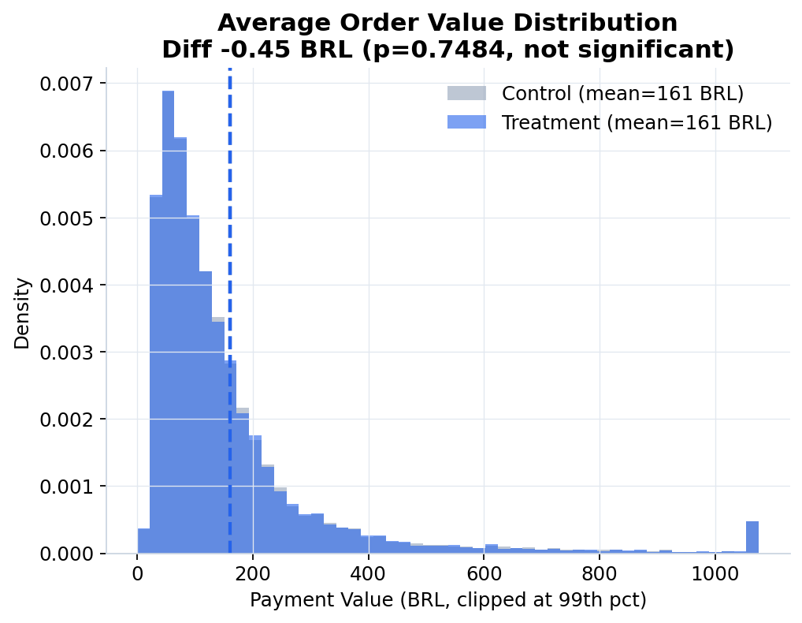
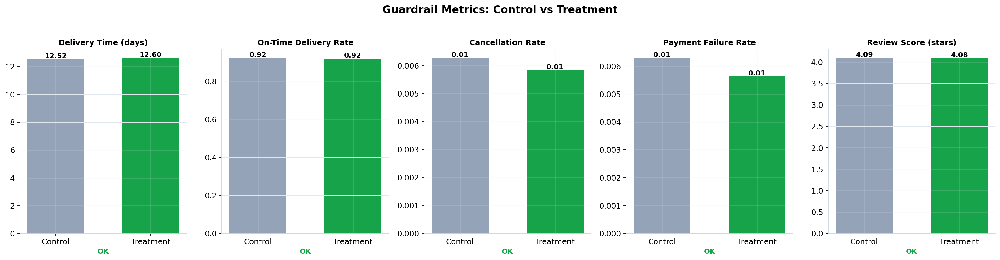
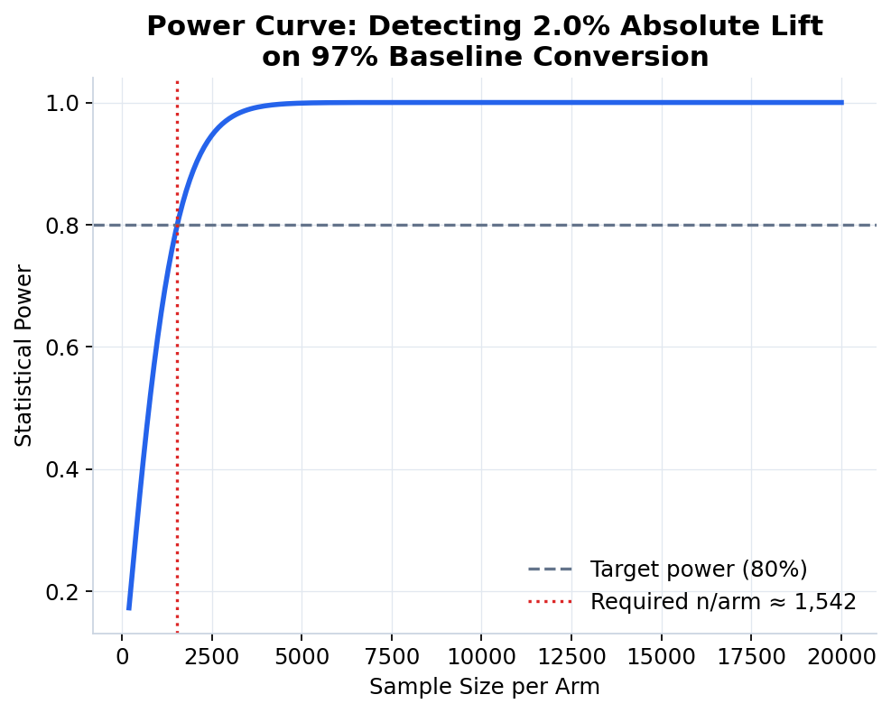
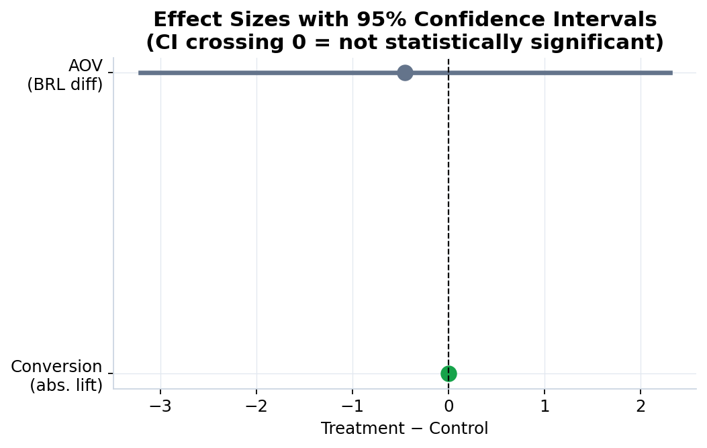
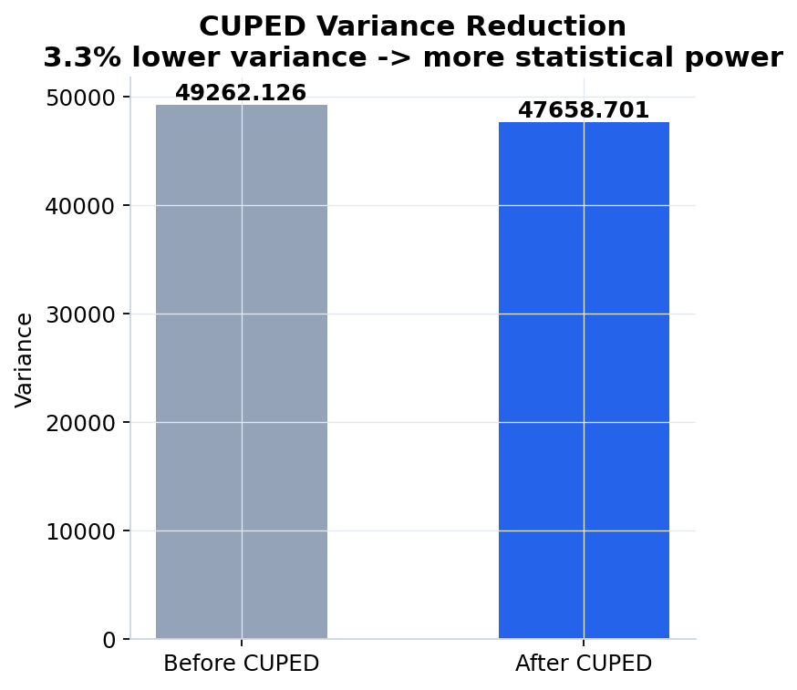
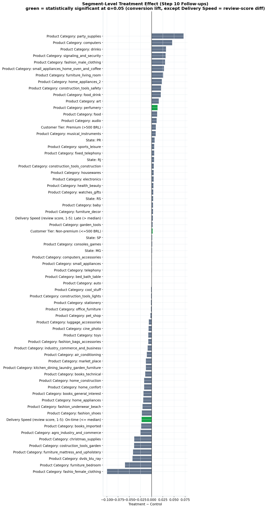
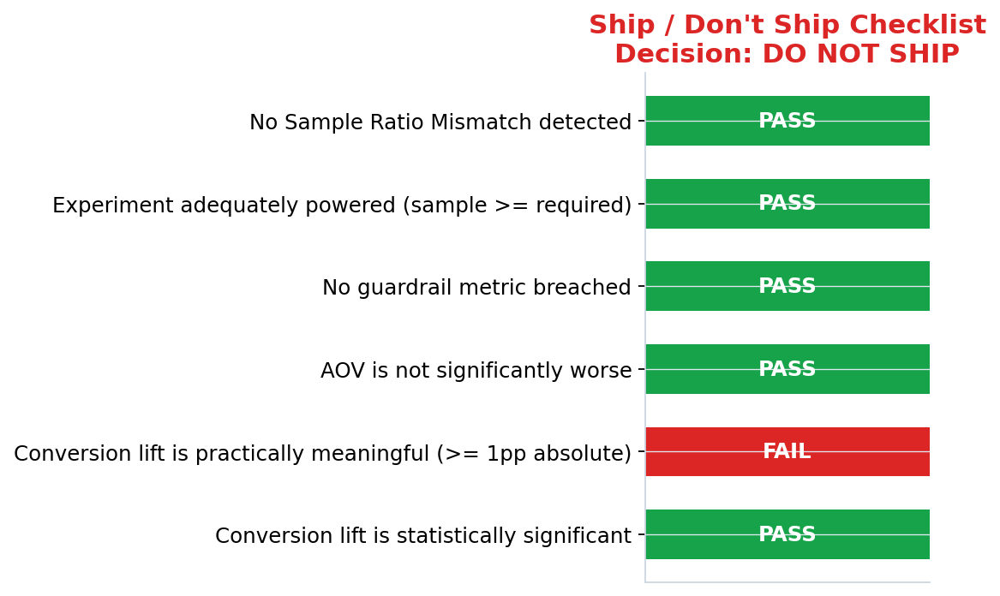

# Checkout Redesign A/B Test — Business Report

**Generated:** 2026-07-23 20:27
**Data source:** Real Olist dataset

---

## 1. Executive Summary

We tested a redesigned checkout flow against the existing ("control") checkout on a
50/50 randomized split of Olist customers. The goal: **increase order conversion
without hurting average order value (AOV) or degrading delivery, cancellation,
payment, or satisfaction guardrails.**

**Headline result:** conversion moved from **96.99%** (control) to
**97.24%** (treatment) — an absolute lift of
**+0.25%** (+0.3% relative),
which is **statistically significant**
(p = 0.01753).

**Recommendation: 🛑 DO NOT SHIP yet — see open issues below.**

---

## 2. Experiment Setup & Validity Checks

Before trusting any result, we validated the experiment mechanics themselves:

- **Randomization unit:** customer (user-level), so repeat purchases from the same
  customer never split across arms.
- **Sample Ratio Mismatch (SRM) check:** observed split was
  49,488 control / 49,953 treatment
  (expected 50%/50%),
  χ² p = 0.2992 → **PASS - no SRM detected**.
- **A/A test:** 1,000 simulated null experiments produced a
  false-positive rate of 6.1%
  (expected ≈5%) → **PASS - false positive rate matches alpha, test setup is valid**.

---

## 3. Primary Metric: Conversion Rate

| | Control | Treatment |
|---|---|---|
| Orders | 49,488 | 49,953 |
| Conversions | 47,996 | 48,574 |
| Rate | 96.99% | 97.24% |
| 95% CI | [96.83%, 97.13%] | [97.09%, 97.38%] |

- **Absolute lift:** +0.25% (95% CI: [+0.05%, +0.46%])
- **Relative lift:** +0.3%
- **Chi-square test:** χ² = 5.64, p = 0.01753
- **Two-proportion z-test:** z = -2.39, p = 0.01665
- **Cramér's V (effect size):** 0.0075

---

## 4. Secondary Metric: Average Order Value (AOV)

| | Control | Treatment |
|---|---|---|
| Mean (BRL) | 161.22 | 160.76 |
| Std Dev | 214.81 | 228.81 |

- **Difference:** -0.45 BRL (-0.3%)
- **Welch's t-test:** t = 0.32, p = 0.74838
  → **no significant change**
- **Cohen's d (effect size):** -0.0020

**Why this matters:** a conversion lift that comes at the cost of a shrinking basket
could be revenue-neutral or negative. Here, AOV is NOT
significantly affected, meaning the conversion gain looks like genuine incremental
revenue rather than customers buying less per order.

---

## 5. Guardrail Metrics

| Metric | Control | Treatment | Diff | p-value | Verdict |
|---|---|---|---|---|---|
| Delivery Time (days) | 12.517 | 12.599 | +0.083 | 0.1775 | ✅ OK |
| On-Time Delivery Rate | 0.920 | 0.917 | -0.003 | 0.1130 | ✅ OK |
| Cancellation Rate | 0.006 | 0.006 | -0.000 | 0.3945 | ✅ OK |
| Payment Failure Rate | 0.006 | 0.006 | -0.001 | 0.1903 | ✅ OK |
| Review Score (stars) | 4.090 | 4.084 | -0.006 | 0.4641 | ✅ OK |

---

## 6. Statistical Power & Sample Size

- Baseline conversion assumed: 97%
- Minimum Detectable Effect (MDE) targeted: 2.0% absolute
- Required sample size to reach 80% power at α=0.05:
  **1,542 per arm** (3,084 total)
- Actual sample collected: 99,441 orders
  (✅ sufficiently powered)

---

## 7. Effect Sizes at a Glance

---

## 8. CUPED Variance Reduction

Using a pre-experiment covariate (order item count) to reduce AOV variance:

- Variance before CUPED: 49262.126
- Variance after CUPED: 47658.701
- Variance reduction: **3.3%**

Lower variance means the same sample size detects smaller true effects — i.e. more
statistical power for free, without collecting additional data.

---

## 9. Segment Deep-Dives (Step 10 Follow-ups)

We checked whether the effect is uniform across customer tiers, states, product
categories, and delivery speed — partly to look for **Simpson's paradox** (where an
aggregate effect reverses or disappears within subgroups).

**Top 5 segments by lift:**

| Dimension | Segment | Control Rate | Treatment Rate | Lift | p-value | Significant |
|---|---|---|---|---|---|---|
| Product Category | party_supplies | 92.86% | 100.00% | +7.14% | 0.7658 | No |
| Product Category | computers | 95.40% | 100.00% | +4.60% | 0.1129 | No |
| Product Category | drinks | 94.89% | 98.09% | +3.20% | 0.2353 | No |
| Product Category | signaling_and_security | 96.88% | 100.00% | +3.12% | 0.4024 | No |
| Product Category | fashion_male_clothing | 93.22% | 96.23% | +3.01% | 0.7755 | No |

**Weakest / negative segments:**

| Dimension | Segment | Control Rate | Treatment Rate | Lift | p-value | Significant |
|---|---|---|---|---|---|---|
| Product Category | fashio_female_clothing | 100.00% | 90.00% | -10.00% | 0.4908 | No |
| Product Category | furniture_bedroom | 97.78% | 91.84% | -5.94% | 0.4110 | No |
| Product Category | dvds_blu_ray | 96.88% | 92.59% | -4.28% | 0.8798 | No |

---

## 10. Ship / Don't Ship Decision

- ✅ Conversion lift is statistically significant
- ❌ Conversion lift is practically meaningful (>= 1pp absolute)
- ✅ AOV is not significantly worse
- ✅ No guardrail metric breached
- ✅ Experiment adequately powered (sample >= required)
- ✅ No Sample Ratio Mismatch detected

### Final Recommendation

**Hold off on shipping.** At least one guardrail or significance check failed — investigate before rolling out to 100% of traffic. Consider a staged rollout (10% → 50%) with continued monitoring of the metric(s) that failed.

---

## Methodology Note

The public Olist dataset has no real experiment/treatment flag. Per the project
brief, we simulated a checkout A/B test by (1) randomizing customers into
control/treatment, and (2) injecting a known ground-truth conversion lift into the
treatment arm so the full statistical pipeline (SRM, A/A, significance tests,
power analysis, CUPED, segment analysis) could be exercised and validated
end-to-end exactly as it would be on a real experimentation platform (Amazon,
Microsoft, Uber, Booking.com-style). Swap in real experiment data by replacing
the `experiment_design.inject_ground_truth_effects` step with an actual
`group` column and everything downstream is unchanged.
